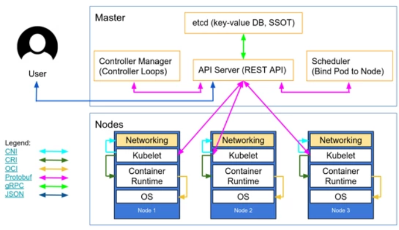
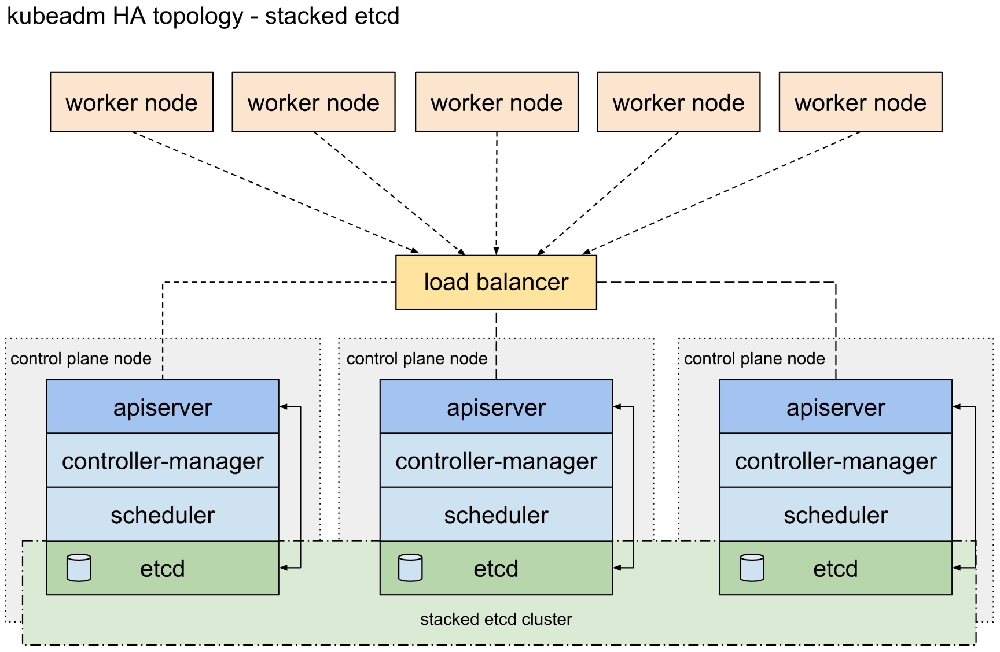

# Openi-Octopus-Deepops


Openi-Octopus的Deepops项目基于[英伟达DeepOps 19.10](https://github.com/NVIDIA/deepops)自动化部署机器学习平台的二次开发。
秉承着约定+简单可靠的思想，删改了英伟达Deepops的复杂安装脚本，实现服务器软件安装脚本的可控运行。

Openi-Octopus集群使用ansible-playbook可以自动化部署K8s GPU 高可用集群或者单master集群。

本脚本的特点是简单可靠地实现了高可用K8s集群的自动化安装

# 环境

操作系统：Ubuntu 16.04 LTS

# K8s集群安装方案介绍

## 单master的K8s集群

本方案采用Kubeadm安装单master的K8s集群

架构图如下：



## 高可用的K8s集群

本方案采用KeepAlived + Haproxy + Kubeadm 安装高可用K8s集群

架构图如下（control plane node = master node）：



### 高可用loadbalancer集群（负载均衡层）

本方案采用 keepalived + haproxy 实现高可用的load balancer集群，在每个master节点上都部署一套 keepalived + haproxy。


haproxy是一个反向代理，利用其可代理多个后端服务的特性，haproxy采用round robin算法充当高可用K8s集群多个master的负载均衡器，它自带了管理工具，方便查看其负载的多个masters（https://MASTERIP:1080/haproxy-status） , 但是在1个master节点安装1个haproxy还是不足以让多master的k8s集群高可用。

haproxy配合keepalived, 在load balancer层实现一套多个haproxy的Master-Backup的热备方案，同一时间只有一个haproxy-MASTER, 其他节点为haproxy-BACKUP。在keepalived中配置虚拟的vip（同一网段没有实体机，ping不通的ip）, 如果一个节点上出故障了，这个vip会自动漂移到另外一个K8s master的haproxy上，启动haproxy-BACKUP备份节点，使得集群具备较强的高可用特性。


### 高可用的K8s集群方案特点：

#### 2层热备

1. 第1层热备：keepalived + haproxy使用Master-Backup方式实现了高可用loadbalancer集群

2. 第2层热备：由于高可用K8s集群有多个master, 这多个master节点都是工作的，haproxy使用roundrobin算法对多个master进行反向代理。
多个masters（apiserver/scheduler/controller-manager）是热备的，而且是无状态的，都可以对请求做出响应，实现集群master层的高吞吐。
多个masters的状态一致性交给了etcd. 在etcd层如果一个etcdMaster节点出故障了，etcd会根据raft算法选举出新的etcdMaster,这也保证了k8s masters层的数据高可用。


# 使用方法

## 一、把deepops自动化安装脚本下载到机器中


## 二、切换root用户

```
$ sudo su
$ 输入sudo密码

```

## 三、先配置，再安装

# 如何配置

### 1. 生成配置文件夹config

以下命令运行完安装必要软件和从config.example文件夹复制出一个文件夹config, 在[ansible.cfg](./ansible.cfg)中指定了该文件夹是实际指挥ansible安装的配置文件夹

```
$ cd deepops
$ ./scripts/setup.sh
$ ./scripts/init_config.sh
```

### 2. K8s集群节点配置

```
$ vi config/inventroy
```

详情请看[inventory节点配置方案](./config.example/inventory)的注释

请注意：[kube-init-master]组指向的唯一ip需要和自动化脚本所在的机器一致

### 3. K8s集群参数配置

```
$ vi config/group_vars/all.yml

```

详情请看[K8s集群参数配置方案](./config.example/group_vars/all.yml)的注释

# 如何首次安装K8s集群

### 首次安装K8s集群，先获取英伟达GPU相关自动安装脚本
```
$ ansible-galaxy install -r requirements.yml
```

### 单master的K8s集群


#### 安装概述：

1. 为每个节点初始化相同的系统环境
2. 为英伟达GPU节点安装环境 —— 作用对象是 [kube-nvidia-gpu-node]节点组
3. 为每个节点安装docker-ce, 并且根据Openi章鱼系统初始化特殊的配置文件 —— 作用对象是 [all]节点组
4. 为每个节点安装kubectl/kubelet/kubeadm,并且根据Openi章鱼系统初始化特殊的配置文件 —— 作用对象是 [all]节点组
5. kubeadm init 初始化单master节点 —— 作用对象是 [kube-init-master]节点组
6. master节点生成worker node节点加入命令 —— 作用对象是 [kube-init-master]节点组
7. 安装calico —— 作用对象是 [kube-init-master]节点组
8. worker node节点加入 —— 作用对象是 [kube-worker-node]节点组
9.  为英伟达GPU worker节点配置英伟达docker并且重启dokcer生效配置 —— 作用对象是 [kube-nvidia-gpu-node]节点组
10. 安装让英伟达GPU资源在K8s集群中可以调度的插件k8s gpu device plugin —— 作用对象是 [kube-nvidia-gpu-node]节点组
11. 为woker节点打label —— 作用对象是 [kube-label-node]节点组

#### 安装命令：

配置好节点方案与参数后，运行以下命令安装K8s集群

```
$ ansible-playbook playbooks/openi-octopus-create-single-k8s-cluster.yml -K
$ 输入sudo密码

```


### 高可用的K8s集群


#### 安装概述：

1. 为每个节点初始化相同的系统环境
2. 安装keepalived + haproxy负载均衡层 —— 作用对象是 [kube-init-master] + [kube-master-node]节点组
3. 为英伟达GPU节点安装环境 —— 作用对象是 [kube-nvidia-gpu-node]节点组
4. 为每个节点安装docker-ce, 并且根据Openi章鱼系统初始化特殊的配置文件 —— 作用对象是 [all]节点组
5. 为每个节点安装kubectl/kubelet/kubeadm,并且根据Openi章鱼系统初始化特殊的配置文件 —— 作用对象是 [all]节点组
6. kubeadm init 初始化第一个master节点 —— 作用对象是 [kube-init-master]节点组
7. master节点生成master node 与 worker node的节点加入命令 —— 作用对象是 [kube-init-master]节点组
8. 安装calico —— 作用对象是 [kube-init-master]节点组
9. master node节点加入 —— 作用对象是 [kube-master-node]节点组
10. worker node节点加入 —— 作用对象是 [kube-worker-node]
11. 为英伟达GPU worker节点配置英伟达docker并且重启dokcer生效配置 —— 作用对象是 [kube-nvidia-gpu-node]节点组
12. 安装让英伟达GPU资源在K8s集群中可以调度的插件k8s gpu device plugin —— 作用对象是 [kube-nvidia-gpu-node]节点组
13. 为woker节点打label  —— 作用对象 是 [kube-label-node]

#### 安装命令：


配置好节点方案与参数后，运行以下命令安装K8s集群
(特别需要检查的是，config/group_vars/all.yml中配置的vip是否为ping不通的空ip，否则会安装失败)

```
$ ansible-playbook playbooks/openi-octopus-create-ha-k8s-cluster.yml -K
$ 输入sudo密码

```


### 首次安装高可用的K8s集群后，如何增加master节点（单master的K8s集群安装模式不能增加master）

```
$ ansible-playbook playbooks/openi-octopus-add-master.yml -K
$ 输入sudo密码
```

首次安装K8s集群完成后，由于机器故障与业务需要，可能需要增加master节点，可运行openi-octopus-add-master.yml

约定1：保持[kube-init-master]节点组的初始化K8s节点不变，因为master节点需要分发密钥对到新的master节点

约定2：[kube-master-node]节点组是集群master节点的存量历史节点组，集群首次安装后需要增加master节点，kube-master-node组的历史安装节点需要保留，不然新mater节点加入集群后，无法更新集群的负载均衡层haproxy中总masters列表配置，会导致集群负载均衡不完全，吞吐能力降低。

约定3：[kube-new-master-node]节点组填入将要计划加入K8s集群充当master的节点

### 首次安装K8s集群后，如何增加worker节点

#### 注意：如果增加英伟达GPU节点，请先在config/group_vars/all.yml（有操作注释）中配置驱动文件下载路径参数 nvidia_driver_run_file_download_url


```
$ ansible-playbook playbooks/openi-octopus-add-node.yml -K
$ 输入sudo密码
```


首次安装K8s集群完成后，由于业务需要，可能需要增加worker节点，可运行openi-octopus-add-node.yml

约定1：保持[kube-init-master]节点组的初始化K8s节点不变，因为master节点需要分发公钥到新的worker节点

约定2：[kube-worker-node]节点组是增量节点组，集群首次安装后需要增加worker节点，kube-worker-node组的历史安装节点需要删除掉，不然在openi-octopus-add-node.yml脚本中也会被认为是新worker节点

约定3: [kube-nvidia-gpu-node]<=[kube-worker-node]。如果[kube-worker-node]节点组中的节点是英伟达GPU节点，还需要将这个节点填写到[kube-nvidia-gpu-node]节点组，安装脚本在完成worker节点加入K8s集群的步骤后，还会给[kube-nvidia-gpu-node]节点组的节点完成在K8s集群激活英伟达GPU资源的操作。另外，配置在[all.yml](./config.example/group_vars/all.yml)配置文件中的参数kube_nvidia_gpu_node_labels，安装脚本会给[kube-nvidia-gpu-node]节点打label。

约定4：[kube-label-node] <= [kube-worker-node]。配置在[all.yml](./config.example/group_vars/all.yml)配置文件中的参数kube_label_node_labels，安装脚本会给[kube-label-node]节点打label。

#### 增加英伟达GPU worker节点，出错: ERROR: Module nvidia is in use! 如何解决 ？

1. 登录错误出现的目标GPU服务器,切换到root用户
```
$ sudo su
```
2. 查看nvidia 内核模块被哪个进程占用
```
$ lsof /dev/nvidia*

$ kill -9 $进程号
```
3. 再次停止nvidia 内核相关模块
```
$ rmmod nvidia_drm
$ rmmod nvidia_modeset
$ rmmod nvidia_uvm
$ rmmod nvidia
```

4. 查看所有nvidia 内核模块已经被卸载, 没有显示就表示已经卸载

```

$ lsmod | grep nvidia

```

5. 手动执行.run 文件 安装脚本

```
$ sh /root/NVIDIA-Linux-x86_64.run -a -s -Z -X
```
6. 验证安装驱动是否正常

```
$ nvidia-smi
$ nvidia-container-cli -k -d /dev/tty info

```


7. 手动修复正常后，重新执行脚本

```
$ ansible-playbook playbooks/openi-octopus-add-node.yml -K
$ 输入sudo密码
```


## 如果kubectl delete node $init-master，可以使用另外一个master当作init-master？

由于kubectl delete node $nodeName命令不会把etcd节点也一起删除，所以如果节点没有关机，还需要删除原来init-master对应的etcd节点，否则etcd集群不健康
会导致此后使用新init-master加入其他节点，加入过程中节点检查过程会失败，导致节点加入失败。
可使用以下命令恢复etcd集群健康：

1. 设置etcd客户端使用v3版本的API

```
$ export ETCDCTL_API=3
```

2. 检查当前集群的member

```
$ etcdctl member  list --cacert /etc/kubernetes/pki/etcd/ca.crt --cert /etc/kubernetes/pki/etcd/server.crt --key /etc/kubernetes/pki/etcd/server.key --write-out=table

```

3. 查看原来init-master对应的节点是否是不健康(etcd_endpoints_list是原集群的etcd集群的endpoints列表，多个(masterip:2379),以逗号分割)

```
$ etcdctl endpoint status --cacert /etc/kubernetes/pki/etcd/ca.crt --cert /etc/kubernetes/pki/etcd/server.crt --key /etc/kubernetes/pki/etcd/server.key --write-out=table --endpoints $etcd_endpoints_list
```

4. 删除不健康的etcd节点(unHealthMemberID从第2步查看member list中获取)

```
$ etcdctl member remove $unHealthMemberID  --cacert /etc/kubernetes/pki/etcd/ca.crt --cert /etc/kubernetes/pki/etcd/server.crt --key /etc/kubernetes/pki/etcd/server.key
```


## 首次安装K8s集群后，如何给K8s集群worker节点打label

```
$ ansible-playbook playbooks/openi-octopus-label-node.yml -K
$ 输入sudo密码
```

该脚本存在的意义在于，在不想新增worker节点的情况下，给集群中worker节点打新的labels。在运行命令前，请先根据如何增加worker节点章节配置labels
该脚本作用的对象是[kube-label-node]节点组，此时openi-octopus-label-node.yml脚本与[kube-worker-node]节点组无关

## 如何更改Es集群的节点数据目录

1. config/group_vars/all.yml 中增加了配置项es_data_dir
2. 执行脚本重新配置所有节点的公共配置
```
$ ansible-playbook playbooks/openi_common_setting_for_all_node.yml -K
```